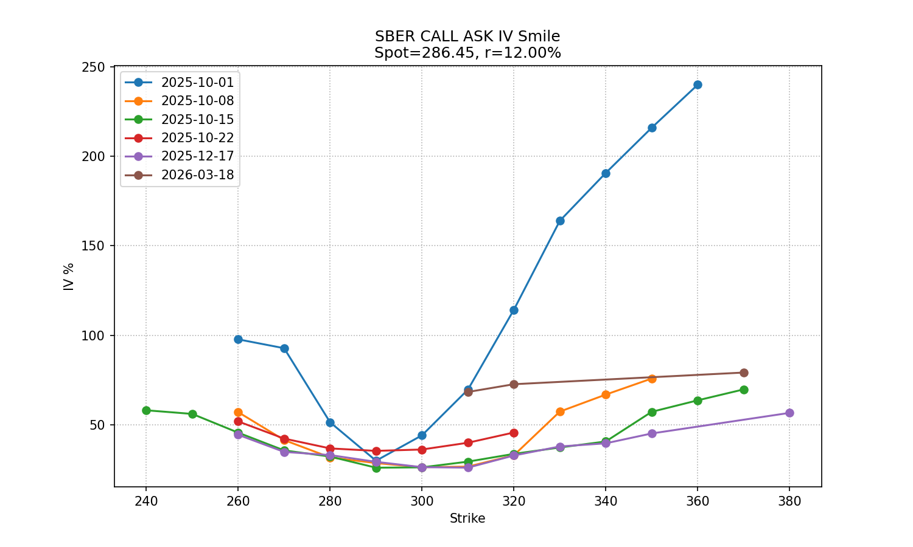
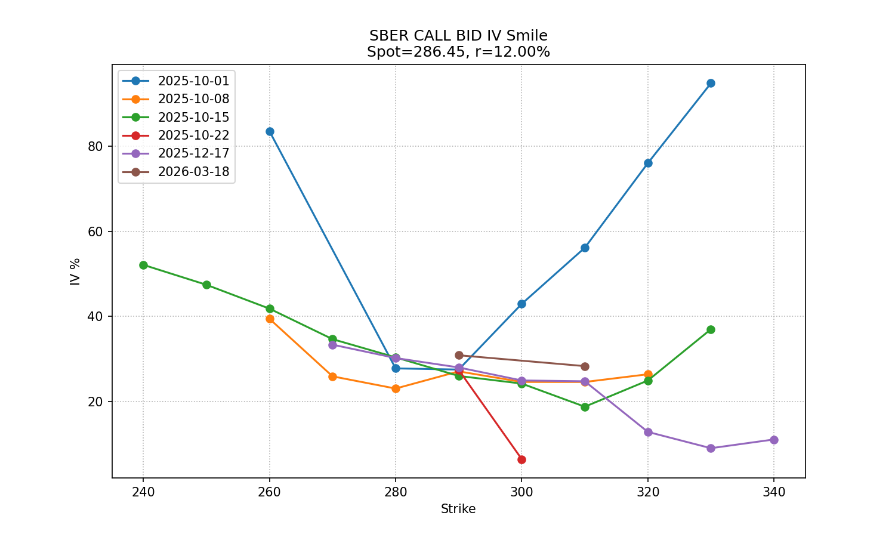
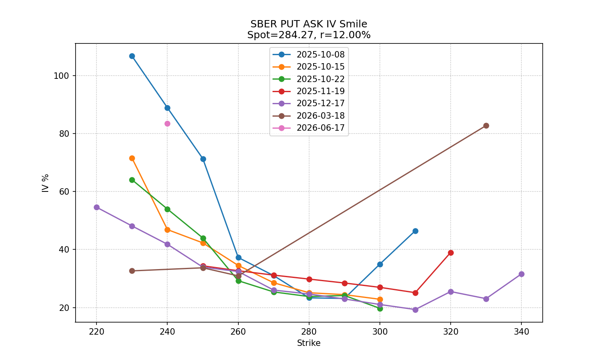
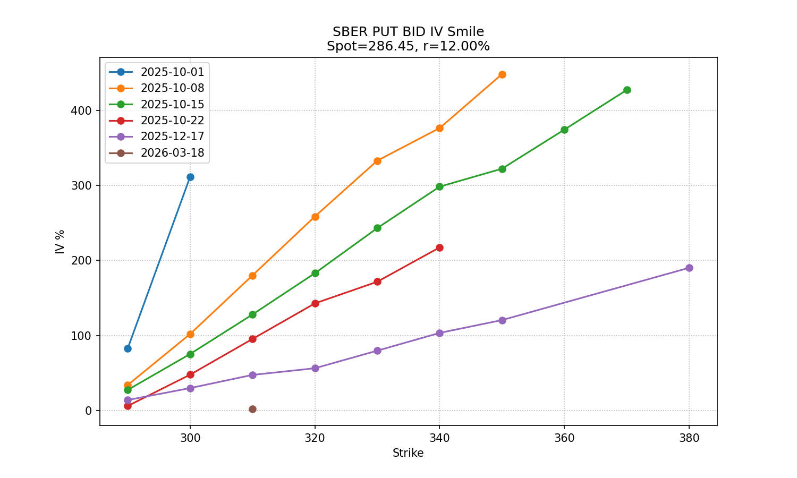
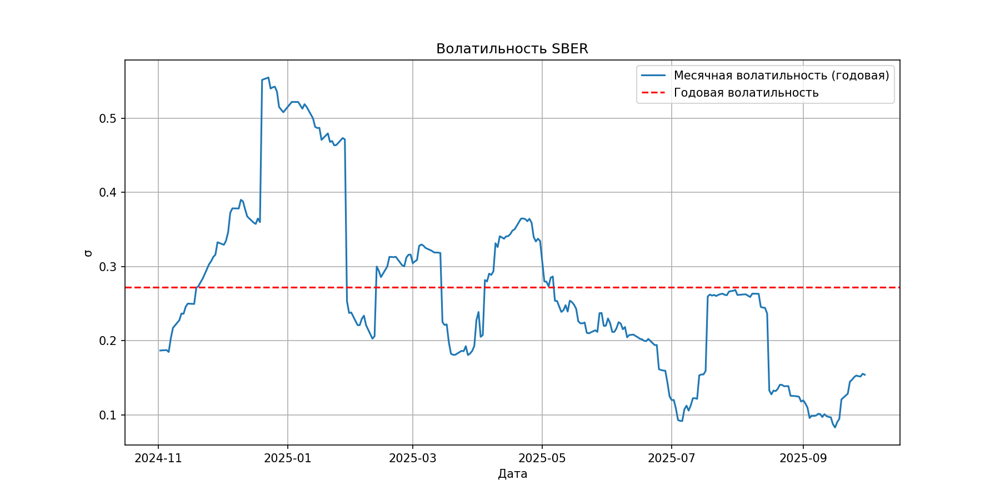

# IV Smile — Smile of SBER Volatility

The script is designed for analysis and visualization of **implied volatility (IV)** on Sberbank stock options.  
He builds a volatility smile for different expiration dates and shows how the market evaluates risk on various strikes.
It also plots the monthly rolling volatility of the underlying asset.

## 📊 Main features
- Building volatility smiles for CALL and PUT options based on prices from market orders (bid/ask) and the Black-Scholes model.
- Visualization of the dynamics of historical volatility of an asset.

### Smile of Volatility CALL (Ask)

### Smile of Volatility CALL (Bid)

### Smile of volatility PUT (Ask)

### Smile of PUT (Bid) volatility

### Historical volatility of SBER

